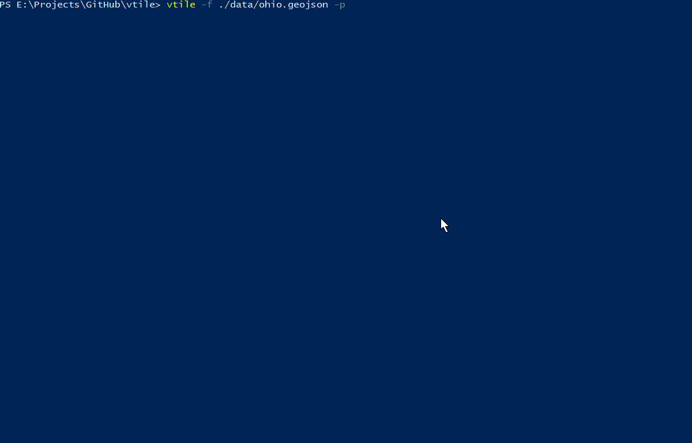

# vtile
### Static vector tiles from a single GeoJSON file.

Install (Size installed - 10.5 MB, ``tylr`` size installed 112 MB)

    npm install vtile -g

Then to create vector tiles.

    vtile -f "sample.geojson" -w -p -Z 8
    
Tiles are created in a '/tiles/layer/' folder in the current working directory, both of which can be configured. A tilejson is created in the '/tiles/layer/' folder, and if ``-p`` is added, an index page is created in the '/tiles/' folder and opened to preview the tiles.



For options use ``vtile -h``.

```
Usage: command [options]
    --file, -f            your geojson file (default: "sample.geojson")
    --dir, -d             directory to store the vector tiles (default: "tiles/")
    --layer, -l           the name of your layer in your vector tile (default: "layer")
    --minzoom, -z         min zoom level to build tiles (default: 0)
    --maxzoom, -Z         max zoom to build tiles (tiles will overzoom in mapbox gl, leaflet and ol3) (default: 10)
    --write, -w           vtile will not write tiles unless -w or -w true (default: false)
    --preview, -p         writes an index page in the tiles dir to preview your tiles, open at port 80 in tiles dir (default: false)
    --help, -h            show help
```

This project uses [TurfJS](https://github.com/Turfjs/turf/) to automate static vector tile creation using [geojson2mvt](https://github.com/NYCPlanning/geojson2mvt). Only turf/center and turf/bbox are used. 

Still in development. For any issues regarding tile creation see geojson2mvt or [geojson-vt](https://github.com/mapbox/geojson-vt). geojson2mvt allows for multiple layers inside a set of vector tiles, while this project only allows for one layer.

Sample GeoJSON file from here - http://eric.clst.org/tech/usgeojson/
